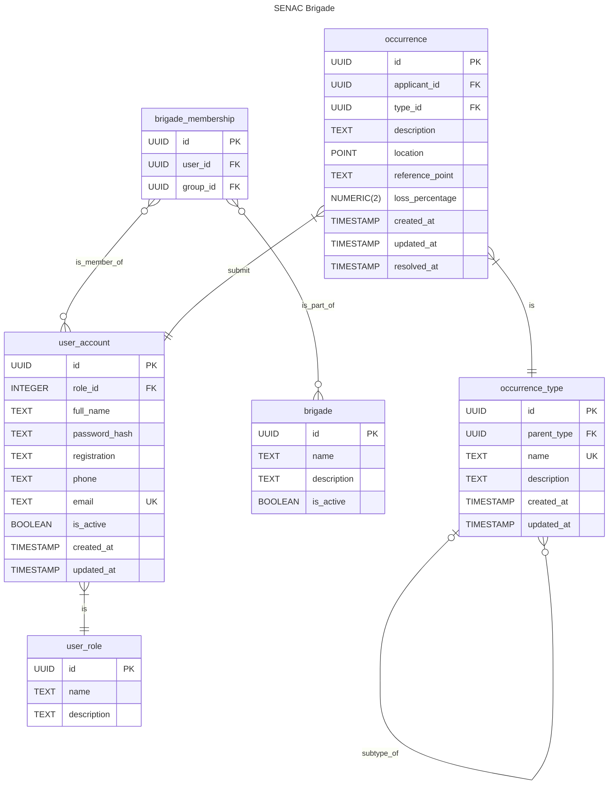

# 👩‍🚒 SENAC Brigade

## Architecture

## Routes

| Route            | Description                 | Expected    |
| ---------------- | --------------------------- | ----------- |
| /api/user/signup | Register a new user account | POST (Form) |
| /api/brigade/:id | List brigade members        | GET         |

## Entity RelationShip Diagram

