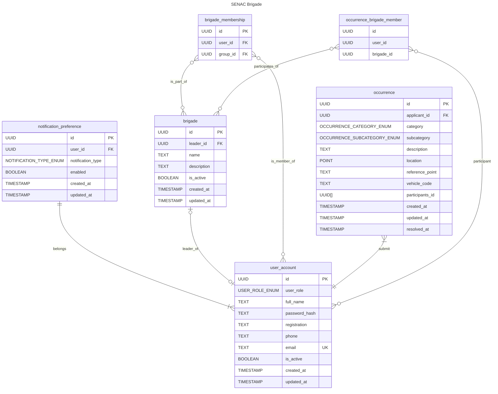

<!-- markdownlint-disable  MD013 -->

# 👩‍🚒 SENAC Brigade

## Architecture

## Routes

| Route                          | Description                                                 | Method      |
| ------------------------------ | ----------------------------------------------------------- | ----------- |
| /admin/signup                  | Register a new user account                                 | POST (Form) |
| /admin/teams                   | Register a new brigade, with a leader and all their members | POST (Form) |
| /admin/teams                   | Query all registered brigades                               | GET         |
| /admin/teams/{{id}}/status     | Update the status of a brigade                              | PUT (JSON)  |
| /admin/teams/{{id}}            | Remove a brigade                                            | DELETE      |
| /user/login                    | Login with your user account                                | POST (Form) |
| /user/profile                  | Retrieve data about the authenticated user                  | GET         |
| /user/roles                    | Get a list of all available roles                           | GET         |
| /user/{{id}}/occurrences       | Find all occurrences applied by this user                   | GET         |
| /user/{{id}}/crew_members      | List fellow brigade members of this user                    | GET         |
| /user/notification_preferences | Fetch authenticated user notification preferences           | GET         |
| /user/notification_preferences | Update authenticated user notification preferences          | PUT         |
| /user/password                 | Update authenticated user password                          | PUT         |
| /brigade/{{id}}/members        | List brigade members                                        | GET         |
| /occurrence/new                | Register new occurrence                                     | POST (Form) |
| /dashboard/stats               | Fetch stats for the dashboard page                          | GET         |

## Entity RelationShip Diagram

