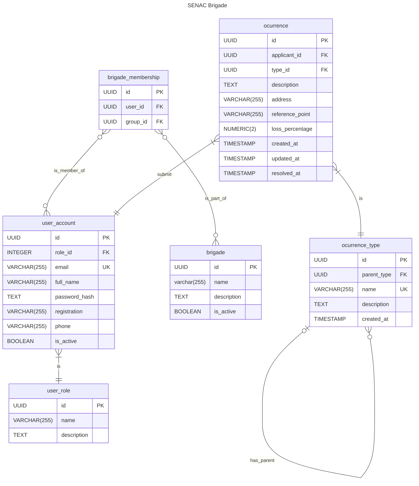

# 👩‍🚒 SENAC Brigade

## Architecture

## Routes

| Route               | Description                 | Expected    |
| ------------------- | --------------------------- | ----------- |
| /cadastrar          | Register a new user account | POST (Form) |
| /listar_membros/:id | List brigade members        | GET         |

## Entity RelationShip Diagram

