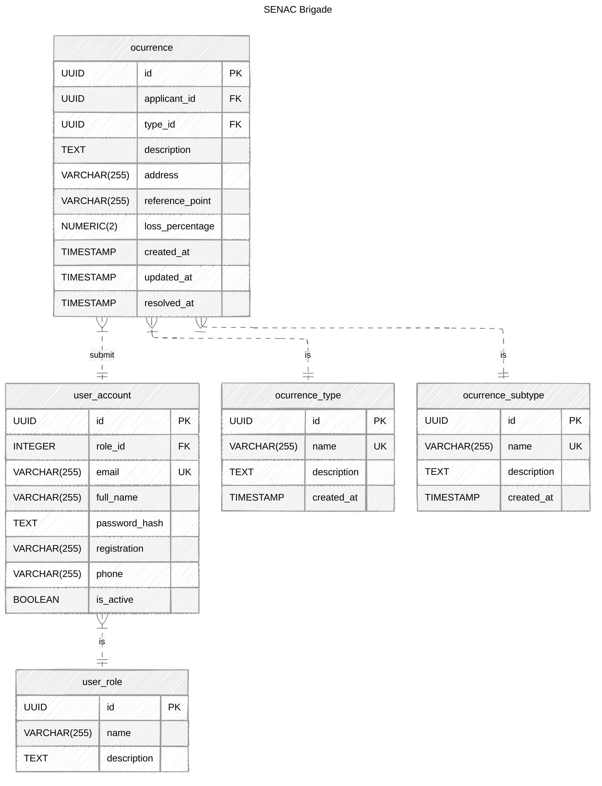

# üë©‚Äçüöí SENAC Brigade

## Architecture

## Entity RelationShip Diagram

```mermaid
---
title: SENAC Brigade
config:
  look: handDrawn
  theme: neutral

  layout: elk
  nodePlacementStrategy: SIMPLE
---
erDiagram

    user_role {
        UUID id PK
        VARCHAR(255) name
        TEXT description
    }

    user_account }|..|| user_role : is
    user_account {
        UUID id PK
        INTEGER role_id FK
        VARCHAR(255) email UK
        VARCHAR(255) full_name
        TEXT password_hash
        VARCHAR(255) registration
        VARCHAR(255) phone
        BOOLEAN is_active
    }

    ocurrence_type {
        UUID id PK
        VARCHAR(255) name UK
        TEXT description
        TIMESTAMP created_at
    }

    ocurrence_subtype {
        UUID id PK
        VARCHAR(255) name UK
        TEXT description
        TIMESTAMP created_at
    }

    ocurrence }|..|| user_account : submit
    ocurrence }|..|| ocurrence_type : is
    ocurrence }|..|| ocurrence_subtype : is
    ocurrence {
        UUID id PK
        UUID applicant_id FK
        UUID type_id FK
        TEXT description
        VARCHAR(255) address
        VARCHAR(255) reference_point
        NUMERIC(2) loss_percentage
        TIMESTAMP created_at
        TIMESTAMP updated_at
        TIMESTAMP resolved_at
    }
```
